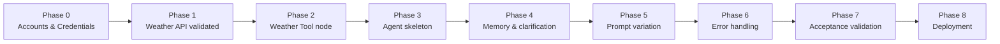

# Implementation Plan

Phase-wise build plan for the workflow described in [Architecture.md](Architecture.md), which implements the requirements in [ProblemStatement.md](ProblemStatement.md). Each phase produces something testable before moving to the next, so problems are caught close to their source (e.g. weather API issues found in Phase 2, before the agent's prompting is layered on top in Phase 3).

## Phase 0 — Prerequisites & Accounts

**Goal:** every credential and account the later phases depend on is in hand.

- [x] Create/confirm a Groq account and generate an API key. *(current key rotated after the original was pasted in chat; stored only in n8n's credential store now — not re-verified here by design.)*
- [x] Choose the weather API provider — **OpenWeatherMap confirmed** (switched from the initial WeatherAPI.com pick after key issues) — and generate an API key for it. *(current key rotated after the original was pasted in chat; stored only in n8n's credential store now — not re-verified here by design.)*
- [x] Confirm access to an n8n instance — **n8n Cloud**.
- [x] In n8n, create the two credentials: **Groq** and a **Query Auth** credential (param name `key`) for OpenWeatherMap — done directly in the n8n Cloud UI.

**Exit criteria:** both API keys work when tested with a raw request (e.g. curl/Postman) outside of n8n, and both credentials exist in n8n's credential list.

## Phase 1 — Weather Tool in Isolation

**Goal:** prove the weather API call works correctly on its own, before any agent/LLM logic is layered on top.

- [ ] Build a throwaway test workflow (or use n8n's manual execution) with a single **HTTP Request** node calling the chosen weather API.
- [ ] Confirm a request with a plain city name (e.g. `London`) returns current-conditions JSON containing temperature, condition text, humidity, wind speed, and precipitation.
- [ ] Confirm behavior for an invalid/unrecognized location — capture what the API actually returns (error body/status code), since this shapes how failures are surfaced later.
- [ ] Note the exact response field names/paths needed in Phase 3's system prompt (e.g. `current.temp_c`, `current.condition.text`).

**Exit criteria:** a manual HTTP Request node call for a known city returns all five target fields; the "not found" response shape is documented.

## Phase 2 — Weather Tool Wrapped for the Agent

**Goal:** turn the proven HTTP call into a callable tool with a schema an LLM can drive.

- [ ] Convert the HTTP Request node into an **HTTP Request Tool** node (or equivalent n8n tool node) attached to the Weather API credential.
- [ ] Define the tool's input schema: single required `location` (string) parameter, with a short description so the LLM knows what to pass (e.g. "City or area name, as mentioned by the user").
- [ ] Write a short tool description (what it does, when to call it) — this is what the LLM sees when deciding to invoke it.
- [ ] Manually test the tool node standalone with a few sample `location` values (clear city, city+country, misspelled/unknown city).

**Exit criteria:** the tool node can be invoked with just a `location` string and returns the same data validated in Phase 1.

## Phase 3 — Chat Trigger + AI Agent Skeleton

**Goal:** get the core agent loop running end-to-end with the Groq model and the weather tool wired together, before refining behavior.

- [ ] Add a **Chat Trigger** ("When chat message received") node as the workflow entry point.
- [ ] Add the **AI Agent** node (Tools Agent) connected to the Chat Trigger.
- [ ] Attach the **Groq Chat Model** node as the agent's model, using the Groq credential; select a Groq-hosted model that supports tool/function calling.
- [ ] Attach the Phase 2 Weather Tool node as the agent's tool.
- [ ] Write a first-draft system prompt covering the core behavior from Architecture.md: extract the location, call the tool when a location is present, answer using only returned fields, keep the reply concise.
- [ ] Run a basic manual test: "What's the weather in Dubai?" and confirm the agent calls the tool and returns a sensible natural-language answer.

**Exit criteria:** at least one clear, unambiguous prompt produces a correct, natural-language weather response end-to-end through the chat trigger.

## Phase 4 — Multi-Turn Memory & Clarification Flow

**Goal:** implement the missing/ambiguous-location handling and the follow-up turn that resolves it.

- [ ] Add the **Window Buffer Memory** node, keyed on the Chat Trigger's `sessionId`, connected to the AI Agent node.
- [ ] Extend the system prompt with explicit clarification instructions: no location → ask for one; ambiguous location (e.g. a city name that exists in multiple places) → ask which one, without calling the tool.
- [ ] Extend the system prompt to treat a tool-returned "location not found" error the same way — ask the user to clarify or re-check spelling, not a raw error.
- [ ] Test the two-turn flow: send a location-less prompt ("What's the weather like?"), confirm a clarifying question comes back, then reply with a city and confirm the agent now completes the weather lookup using the earlier context.

**Exit criteria:** both the "missing location" and "ambiguous location" acceptance criteria from Architecture.md pass, and the session correctly carries context into the follow-up turn.

## Phase 5 — Prompt Variation & Response Quality

**Goal:** confirm the agent generalizes across phrasing, not just the one test prompt from Phase 3.

- [ ] Test the three example prompts from ProblemStatement.md verbatim: *"What's the weather in Dubai?"*, *"How is the weather in London right now?"*, *"Tell me the current temperature in Mumbai."*
- [ ] Test a handful of additional phrasings/locations (different regions, multi-word city names, city+country combos) to catch prompt-extraction gaps.
- [ ] Review response wording against the "clear, concise, conversational" bar in Architecture.md — adjust the system prompt if replies read as raw data dumps or are overly verbose.
- [ ] Confirm the agent never fabricates a field the API didn't return (e.g. no invented precipitation value when the API omits it).

**Exit criteria:** all example prompts from the problem statement resolve correctly, and spot-checked variations behave consistently.

## Phase 6 — Error Handling & Edge Cases

**Goal:** harden the workflow against failures beyond "location not found."

- [ ] Test weather API downtime/timeout behavior (e.g. temporarily point the tool at a bad URL or use a very short timeout) — confirm the agent responds gracefully rather than crashing the workflow.
- [ ] Test a nonsensical or off-topic prompt (e.g. "tell me a joke") — confirm the agent doesn't force a tool call or hallucinate weather data.
- [ ] Test an empty/blank prompt.
- [ ] Confirm the HTTP Request Tool node's error output (if it errors rather than returning a JSON error body) is configured to continue the workflow and surface a usable message to the agent, rather than halting execution.

**Exit criteria:** no test case in this phase causes the workflow to fail/halt without producing a user-facing response.

## Phase 7 — Final Validation Against Acceptance Criteria

**Goal:** sign off against the checklist already defined in ProblemStatement.md and Architecture.md.

- [ ] Re-run every acceptance criterion from ProblemStatement.md's checklist end-to-end in the built workflow.
- [ ] Re-check the "Handling the Acceptance Criteria" table in Architecture.md row by row against actual behavior.
- [ ] Confirm the workflow is a single n8n workflow with no manual steps between trigger and response.
- [ ] Save/export the finished workflow (and note the chosen weather provider and Groq model in the docs, since both were left as open points).

**Exit criteria:** every checklist item in ProblemStatement.md is checked off against real, observed behavior — not assumed.

## Phase 8 — Deployment

**Goal:** make the workflow usable outside of manual test executions.

- [ ] Decide and configure the Chat Trigger's deployment surface (n8n's hosted chat widget vs. embedding the webhook elsewhere) — the remaining open point from Architecture.md.
- [ ] Activate the workflow in n8n.
- [ ] Do a final smoke test through the real deployment surface (not just "Execute Workflow" in the editor).

**Exit criteria:** a user can reach the agent through the chosen deployment surface and get a real-time weather answer without any n8n editor interaction.

## Suggested Order & Dependencies

Phases are sequential by design — each one isolates a failure mode (bad API call, bad tool schema, bad agent wiring, bad clarification logic, bad phrasing coverage, bad error handling) so that when something breaks later, the cause is narrowed to the newest phase rather than the whole stack.
